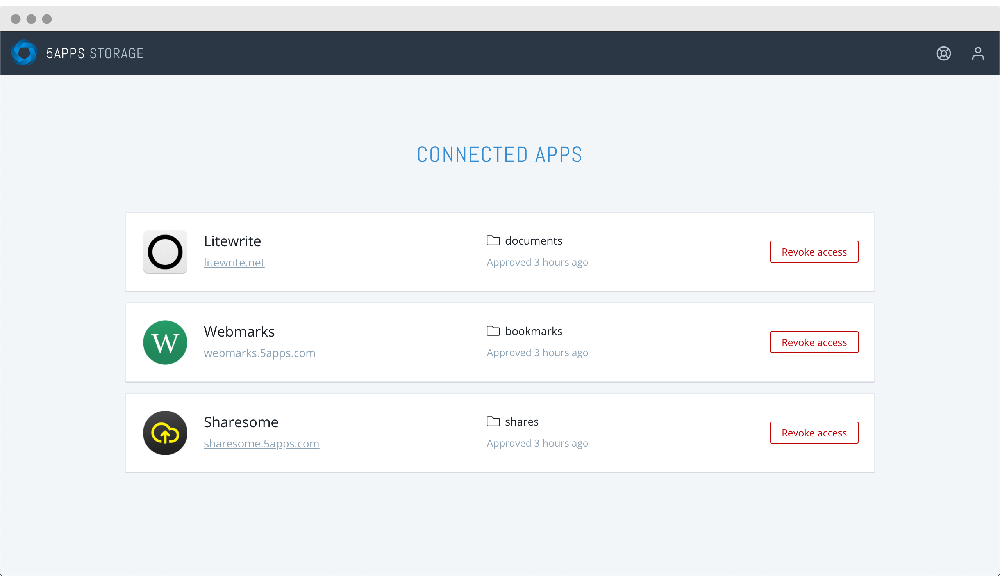

# Stashboard

Stashboard is a dashboard application for managing one's
[remoteStorage](https://remotestorage.io/) account. It has been created by
5apps as the front-end for [5apps Storage](https://5apps.com/storage).

## Storage providers & developers

Feel free to use this for your own server implementation, and also to just
re-use parts of the code (e.g. markup and styles).

If you are genuinely interested in adopting this front-end for your server
implementation, we would also be willing to help with making the app more
customizable, so that you wouldn't have to run a custom fork per se. The GitHub
issues are open for any and all requests.

## Users

For security reasons, it is not currently possible to log into your 5apps
account when the app is not opened from `rs.5apps.com`. This may change in the
future.

## Prerequisites

You will need the following things properly installed on your computer.

* [Git](https://git-scm.com/)
* [Node.js](https://nodejs.org/) (with npm)
* [Ember CLI](https://ember-cli.com/)
* [Google Chrome](https://google.com/chrome/)

## Installation

* `git clone git@github.com:5apps/stashboard.git` this repository
* `cd stashboard`
* `npm install`

## Running / Development

* `npm start`
* Visit your app at [http://localhost:4200](http://localhost:4200).
* Visit your tests at [http://localhost:4200/tests](http://localhost:4200/tests).

### Running Tests

* `ember test`
* `ember test --server`

### Linting

* `npm run lint:hbs`
* `npm run lint:js`
* `npm run lint:js -- --fix`

### Deploying

* `npm run deploy:staging` or `npm run deploy:production`
